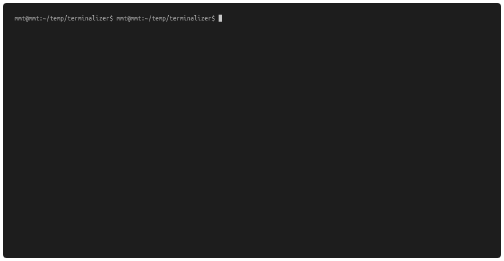

# terminalizer
A docker container of https://github.com/faressoft/terminalizer

Run `make` to build a container image. You may want to change `TAG_NAME` inside Makefile

`config.yml` will be used as default configuration for [terminalizer](https://github.com/faressoft/terminalizer)

# Usage

- Start docker container: `docker run --rm -it -v $PWD:/share nhnghia/terminalizer`

- Once inside the running container, Start recording: `terminalizer record demo`

- Type several commands and run them as you want

- Stop recording by pressing `Ctrl+D` or `exit`

- Replay the record: `terminalizer play demo`

# Example

